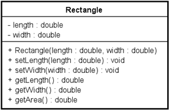

# Kapitel 3 – Klasser

## 1. Introduktion

Session 3 bygger videre på arbejdet med klasser og objekter fra Session 1 og 2.

Fokus er nu på:

- klassedesign
- konstruktører
- primitive datatyper
- UML-klassediagrammer
- objektmetoder
- design af meningsfulde klasser

Målet er ikke kun at skrive kode, men også at designe klasser med et klart responsibility (ansvar).

---

## 2. En klasse beskriver objekter

En klasse er en model til oprettelse af objekter.

Eksempel:

```java
public class Rectangle
{
  private double length;
  private double width;

  public Rectangle(double length, double width)
  {
    this.length = length;
    this.width = width;
  }
}
```

Klassen beskriver:

- hvilke data objekter gemmer
- hvilke operationer objekter kan udføre

Objekter, der oprettes ud fra en klasse, kaldes instanser.

---

## 3. Instansvariabler (felter)

Instansvariabler gemmer et objekts state (tilstand).

Eksempel:

```java
private double length;
private double width;
```

Hvert objekt har sine egne værdier.

Eksempel:

```java
Rectangle r1 = new Rectangle(10, 20);
Rectangle r2 = new Rectangle(5, 8);
```

`r1` og `r2` gemmer forskellige værdier.

---

## 4. Konstruktører

Konstruktører initialiserer objekter.

Eksempel:

```java
public Rectangle(double length, double width)
{
  this.length = length;
  this.width = width;
}
```

Konstruktøren sikrer, at objektet starter med en initial state.

Objekter oprettes ved hjælp af `new`:

```java
Rectangle rect = new Rectangle(10.0, 20.0);
```

---

## 5. Formålet med konstruktører

Formålet med en konstruktør er at initialisere alle instansvariabler.

Eksempel:

```java
public Rectangle()
{
  setLength(1.0);
  setWidth(1.0);
}
```

En konstruktør bør efterlade objektet i en meningsfuld state.

---

## 6. Metoder

Metoder definerer et objekts behavior (adfærd).

### Accessor-metoder (getters)

Accessor-metoder returnerer information.

Eksempel:

```java
public double getLength()
{
  return length;
}
```

### Mutator-metoder (setters)

Mutator-metoder ændrer objektets state.

Eksempel:

```java
public void setWidth(double width)
{
  this.width = width;
}
```

---

## 7. Beregnede metoder

Nogle metoder beregner værdier ud fra objektets state.

Eksempel:

```java
public double getArea()
{
  return length * width;
}
```

`Rectangle`-objektet har responsibility for at beregne sit eget areal.

---

## 8. UML-klassediagrammer

Session 3 introducerer simple UML-klassediagrammer.

Et UML-klassediagram viser:

- klassenavn
- attributter (felter)
- konstruktører
- operationer (metoder)

Eksempel:



UML hjælper med at forbinde design og implementering.

---

## 9. Primitive datatyper

Session 3 introducerer flere primitive datatyper.

### Heltalstyper

```java
byte
short
int
long
```

### Decimaltalstyper

```java
float
double
```

### Andre primitive datatyper

```java
boolean
char
```

Valget af datatype afhænger af variablens responsibility.

---

## 10. char

Datatypen `char` gemmer ét enkelt Unicode-tegn.

Eksempel:

```java
char gender = 'M';
```

Tegn skrives med enkelte anførselstegn.

Strings skrives med dobbelte anførselstegn.

Eksempel:

```java
String name = "Bob";
char gender = 'M';
```

---

## 11. Valg af passende datatyper

Valg af datatyper er en del af klassedesign.

Eksempel:

```java
private String phone;
```

Telefonnumre repræsenteres ofte bedst som `String`, fordi:

- de bruges ikke til beregninger
- de kan indeholde landekoder
- de kan begynde med nul

Godt design handler om at vælge datatyper, der repræsenterer domænet korrekt.

---

## 12. Standardkonstruktører

Hvis der ikke skrives en konstruktør, opretter Java automatisk en standardkonstruktør.

Eksempel:

```java
Rectangle rectangle = new Rectangle();
```

Standardkonstruktøren:

- tager ingen argumenter
- tildeler standardværdier

Standardværdier omfatter:

- `0` for heltal
- `0.0` for decimaltal
- `false` for booleans
- `null` for referencer

Standardværdier er dog ikke altid meningsfulde.

Eksempel:

- Et rektangel med bredden `0.0` giver måske ikke mening.

---

## 13. Flydende kommatal

Flydende kommatal er approksimationer.

Eksempel:

```java
double value = 0.1 + 0.2;
```

På grund af afrundingsfejl anvendes en epsilon-værdi i tests.

Eksempel:

```java
private static final double EPSILON = 0.00001;
```

```java
assertEquals(0.3, value, EPSILON);
```

---

## 14. Objektmetoder

Alle klasser nedarver metoder fra klassen `Object`.

Vigtige metoder er:

- `toString()`
- `equals()`

Disse metoder findes allerede, selv hvis du ikke selv implementerer dem.

---

## 15. toString()

`toString()` returnerer en strengrepræsentation af et objekt.

Eksempel:

```java
public String toString()
{
  return name + ", semester=" + semester;
}
```

Det gør objekter lettere at:

- vise
- fejlfinde
- teste

Efter Session 3 bør relevante domæneklasser implementere `toString()`.

---

## 16. equals()

`equals()` sammenligner objekters indhold.

Eksempel:

```java
person1.equals(person2)
```

Dette er anderledes end:

```java
person1 == person2
```

`==` sammenligner referencer.

`equals()` sammenligner betydning eller indhold.

Efter Session 3 bør værdilignende klasser implementere `equals()`.

---

## 17. Test af klasser

Test er fortsat en vigtig del af kurset.

Eksempel:

```java
@Test void stateAfterZeroArgsConstructor()
{
  Rectangle rectangle = new Rectangle();

  assertEquals(1.0, rectangle.getLength(), EPSILON);
  assertEquals(1.0, rectangle.getWidth(), EPSILON);
}
```

Tests bør kontrollere:

- state efter oprettelse
- metoders behavior
- beregnede værdier

---

## 18. Typiske begynderfejl

Almindelige fejl:

1. At glemme at initialisere instansvariabler.
2. At forveksle felter og lokale variabler.
3. At vælge forkerte datatyper.
4. At glemme, at `==` sammenligner referencer.
5. At skrive klasser uden et klart responsibility.
6. At ignorere meningsfulde standardtilstande.

---

## 19. Refleksionsspørgsmål

- Hvad er en konstruktørs responsibility?
- Hvad er forskellen mellem en getter og en setter?
- Hvorfor er nogle metoder beregnede metoder?
- Hvorfor er `String` ofte et bedre valg end numeriske datatyper til telefonnumre?
- Hvad er forskellen mellem `==` og `equals()`?
- Hvorfor bør klasser implementere `toString()`?

---

## Opsummering

Session 3 fokuserer på design af meningsfulde klasser.

Vigtige idéer er:

- konstruktører initialiserer objekter
- klasser gemmer state i felter
- metoder definerer behavior
- UML forbinder design og implementering
- primitive datatyper bør vælges omhyggeligt
- objekter nedarver metoder fra `Object`
- `toString()` og `equals()` gør klasser mere anvendelige

Godt klassedesign handler om at tildele klare responsibilities og repræsentere domænet korrekt.
