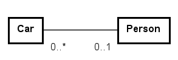
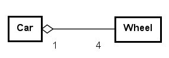
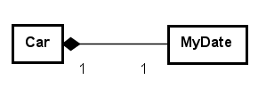
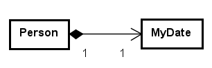

# Kapitel 8 – Association, aggregation og composition

## 1. Introduktion

Objektorienteret design handler ikke kun om enkelte klasser, men om relationer mellem dem.

I dette kapitel ser vi på association, aggregation og composition – og hvad ejerskab betyder i praksis.

## 2. Faglig gennemgang

En relation mellem to klasser kan udtrykke, at objekter samarbejder eller indeholder hinanden. UML giver et sprog til at vise relationen, og især at diskutere ejerskab.

Ejerskab handler om, hvem der har ansvar for et objekts livscyklus. Spørgsmålet er ikke, om et objekt har en reference til et andet, men om det andet objekt logisk er en del af det første.

Nedenfor vises tre beslægtede UML-relationer. De ligner hinanden, men betyder noget forskelligt.

### 2.1 UML-eksempler på ejerskab

Association: Car har en ejer Person. Ejeren kan eksistere uafhængigt af bilen. Derfor er relationen typisk en association.



Figur 8.1 – Association mellem Car og Person. En Car kan have 0 eller 1 ejer (Person), og en Person kan eje 0 eller flere biler.

Aggregation: Car har flere Wheel. Hjul kan i princippet eksistere uafhængigt (fx på et lager), og kan udskiftes. Den hule diamant ved Car betyder “svagt ejerskab” og betyder "del-af" (at et hjul er en del af bilen).



Figur 8.2 – Aggregation mellem Car og Wheel. Her har en bil altid præcis 4 hjul og et hjul tilhører kun én bil.

Composition: Car har en registreringsdato MyDate. Den sorte diamant betyder “stærkt ejerskab”: registreringsdatoen giver typisk ikke mening uden bilen og oprettes ofte sammen med bilen. Det beyder både "del-af" og "ejer" (at Car-objektet ejer MyDate-objektet).



Figur 8.3 – Composition mellem Car og MyDate (1 registreringsdato)

Bemærk: UML siger ikke, hvordan du implementerer dette i Java. UML hjælper dig med at tage stilling til ansvar og ejerskab, før du skriver kode.

## 3. Eksempel: Song – Time

```
public class Time {

    private int seconds;

    public Time(int seconds) {
        if (seconds < 0) {
            throw new IllegalArgumentException();
        }
        this.seconds = seconds;
    }

    public int getSeconds() {
        return seconds;
    }
}
public class Song {

    private String title;
    private Time duration;

    public Song(String title, Time duration) {
        this.title = title;
        this.duration = duration;
    }

    public int getDurationInSeconds() {
        return duration.getSeconds();
    }
}
```
Her har Song en relation til Time. Time repræsenterer varigheden af sangen og kan betragtes som en del af Song. Hvis Time modelleres som en selvstændig klasse med livscyklus knyttet til Song, kan relationen vises som composition.

Hvis Time derimod opfattes som et value-objekt uden selvstændig identitet, bør det modelleres som en attribut (duration : Time). I så fald kan flere Song-objekter godt have samme varighedsværdi, og eventuel deling af immutable instanser i implementationen er uproblematisk og uden betydning for modellen.


## 4. Eksempel: Person – MyDate

```
public class Person {

    private MyDate birthDate;

    public Person(MyDate birthDate) {
        this.birthDate = birthDate;
    }

    public MyDate getBirthDate() {
        return birthDate;
    }
}
```
Person indeholder en MyDate, som repræsenterer personens fødselsdato. MyDate betragtes som en integreret del af Person og har ingen selvstændig identitet eller livscyklus i systemet. Derfor modelleres relationen som composition: hver Person har præcis én MyDate, og den MyDate hører til netop den person.

Implementationsmæssigt betyder det, at Person bør beskytte sin interne tilstand. Hvis MyDate er mutable, bruges defensive copying i konstruktør og getter for at undgå representation exposure. Hvis MyDate er immutable, er defensive copying ikke nødvendig, men relationen er stadig composition, fordi ejerskab/livscyklus i domænet er uændret.

Der er nu taget stilling til hvem der har kendskab til hvem, her at Person har et MyDate-objekt (og at MyDate-objektet ingen kendskab har til Person-objektet). Dette vises i UML med en pilespids pegende fra Person til MyDate, se figur 8.4:



Figur 8.4 – Composition mellem Person og MyDate. Personen ejer MyDate-objektet og én person har én fødselsdato.


## 5. Designovervejelser

Fordele ved composition:
- Tydeligt ejerskab og ansvar
- Færre uventede sideeffekter

Ulemper ved for stærkt ejerskab:
- Mindre fleksibilitet, hvis objekter i praksis skal deles eller genbruges

En tommelfingerregel: Brug strong ejerskab, når “delen” ikke giver mening uden “helheden” i domænet.

## 6. Typiske fejl og misforståelser

1. At vælge composition uden at tænke over, om delobjekter skal deles.
2. At dele mutable delobjekter mellem flere ejere.
3. At returnere interne delobjekter direkte uden at overveje representation exposure.
4. At modellere relationer ud fra implementeringsdetaljer i stedet for domænet.

## 7. Refleksionsspørgsmål

1. Hvornår giver det mening at sige, at et objekt “ejer” et andet?
2. Hvordan påvirker immutability valget mellem association og composition?
3. Hvilke konsekvenser har ejerskab for test og fejlretning?

## 8. Små øvelser

Øvelse 1: Tegn et UML-klassediagram for en Playlist, der indeholder flere Song-objekter. Er relationen association, aggregation eller composition? Begrund.

Øvelse 2: Overvej Person–MyDate: Implementér en version af konstruktøren i Person, der laver defensive copying. Forklar, hvornår det er nødvendigt.
