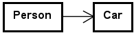
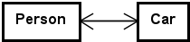
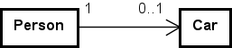
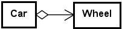
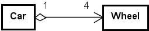

# Kapitel 10 – Associationer

## 1. Introduktion

Session 10 introducerer relationer mellem objekter.

Indtil nu har de fleste eksempler fokuseret på enkelte objekter.

Session 10 fokuserer på, hvordan objekter samarbejder.

Fokus er på:

- associationer
- aggregering
- komposition
- navigerbarhed
- multiplicitet
- objektsamarbejde
- UML-relationer

Objektorienteret programmering handler i høj grad om at designe meningsfuldt samarbejde mellem objekter.

---

## 2. Objekter samarbejder

Objekter eksisterer sjældent isoleret.

Eksempler:

- en `Person` kan eje en `Car`
- en `Student` tilhører en `SchoolClass`
- et `House` indeholder `Room`-objekter
- et `Library` gemmer `Book`-objekter

Relationer mellem objekter er centrale i domænemodellering.

---

## 3. Associationer

En association er en relation mellem objekter.

Eksempel:

```java
public class Person
{
  private Car car;
}
```

Et `Person`-objekt er associeret med et `Car`-objekt.

Feltet gemmer en reference til et andet objekt.

---

## 4. Navigerbarhed

Navigerbarhed beskriver, hvilket objekt der kender til det andet.

Eksempel:

```java
public class Person
{
  private Car car;
}
```

`Person` kan navigere til `Car`.

Men hvis `Car` ikke gemmer en reference til `Person`, er relationen envejs.

Eksempel:



---

## 5. Tovejsassociationer

Nogle gange kender begge objekter til hinanden.

Eksempel:

```java
public class Person
{
  private Car car;
}
```

```java
public class Car
{
  private Person owner;
}
```

Nu kan begge objekter navigere til hinanden.

Eksempel:



Tovejsassociationer kræver omhyggeligt design.

---

## 6. Multiplicitet

Multiplicitet beskriver, hvor mange objekter der indgår i en relation.

Eksempler:

| Multiplicitet | Betydning |
|---|---|
| `1` | præcis én |
| `0..1` | nul eller én |
| `*` | mange |
| `0..*` | nul eller flere |
| `1..*` | én eller flere |

Eksempel:



En person kan eje nul eller én bil.

---

## 7. En-til-mange-relationer

Samlinger bruges ofte i en-til-mange-relationer.

Eksempel:

```java
public class SchoolClass
{
  private ArrayList<Student> students;
}
```

Ét `SchoolClass`-objekt kan indeholde mange studerende.


---

## 8. Håndtering af relationer

Den ansvarlige klasse bør håndtere relationen.

Eksempel:

```java
public void addStudent(Student student)
{
  students.add(student);
}
```

Samlingen bør normalt være privat.

Andre klasser bør ikke manipulere samlingen direkte.

---

## 9. Søgning efter associerede objekter

Relationer gennemløbes ofte ved hjælp af løkker.

Eksempel:

```java
public Student findStudent(String name)
{
  for (Student student : students)
  {
    if (student.getName().equals(name))
    {
      return student;
    }
  }
  return null;
}
```

Objekter samarbejder gennem deres associationer.

---

## 10. Aggregering

Aggregering repræsenterer en hel-del-relation.

Eksempel:



Delene kan eksistere uafhængigt af helheden.

Eksempel:

- et `Wheel` kan eksistere uden en `Car`
- `Wheel` er en del af `Car`
- hjulet kan fjernes og lægges på lager eller genbruges i en anden bil

Aggregering repræsenterer normalt et svagere ejerskab.

---

## 11. Komposition

Komposition er en stærkere hel-del-relation.

Eksempel:


Delen hører tæt sammen med helheden.

Eksempel:

- et `Room` eksisterer normalt ikke uafhængigt af et `House`
- `Room` er en del af `House`
- et rum kan ikke fjernes fra huset

Komposition indebærer ofte:

- ejerskab
- afhængighed af levetid

---

## 12. Sammenligning af relationstyper

### Association

En generel relation.

Eksempel:


### Aggregering

En svag hel-del-relation.

Eksempel:


### Komposition

En stærk ejerskabsrelation.

Eksempel:


Valget afhænger af betydningen i domænet.

---

## 13. UML-relationer

UML-diagrammer viser relationer grafisk.

Eksempel:





Relationslinjerne beskriver:

- navigerbarhed
- multiplicitet
- relationstype

UML hjælper med at modellere samarbejde mellem objekter før implementeringen.

---

## 14. Konstruktørers responsibility

Konstruktører initialiserer ofte relationer.

Eksempel:

```java
public SchoolClass()
{
  students = new ArrayList<>();
}
```

Samlinger bør normalt initialiseres i konstruktøren.

---

## 15. Responsibility og associationer

Den klasse, der har responsibility for relationen, bør også administrere den.

Eksempel:

God løsning:

```java
schoolClass.addStudent(student)
```

Mindre god løsning:

```java
schoolClass.getStudents().add(student)
```

Encapsulation gælder stadig.

Den interne struktur bør forblive beskyttet.

---

## 16. Fjernelse af associerede objekter

Associationer understøtter ofte fjernelse.

Eksempel:

```java
public void removeStudent(Student student)
{
  students.remove(student);
}
```

Den ansvarlige klasse styrer ændringerne.

---

## 17. Valgfrie relationer

Associationer kan være valgfrie.

Eksempel:

```java
private Car car;
```

En person behøver ikke eje en bil.

Eksempel:

```java
car == null
```

Selektionsstrukturer bruges ofte til at håndtere valgfrie relationer.

---

## 18. toString() og relationer

`toString()`-metoder kan inkludere associerede objekter.

Eksempel:

```java
public String toString()
{
  return name + ", owner=" + owner.getName();
}
```

Man skal være opmærksom på cirkulære referencer.

---

## 19. Test af relationer

Relationer bør testes grundigt.

Eksempel:

```java
@Test void addStudent()
{
  SchoolClass c = new SchoolClass();
  Student s = new Student("Bob");

  c.addStudent(s);

  assertEquals(1, c.getNumberOfStudents());
}
```

Tests bør kontrollere:

- tilføjelse af relationer
- fjernelse af relationer
- søgning
- multiplicitet

---

## 20. Typiske begynderfejl

Almindelige fejl:

1. At eksponere samlinger direkte.
2. At glemme at initialisere samlinger.
3. At placere logikken for relationer i den forkerte klasse.
4. At forveksle aggregering og komposition.
5. At glemme begrænsninger i multiplicitet.
6. At skabe inkonsistente tovejsassociationer.
7. At glemme `null`-tilfælde.

---

## 21. Refleksionsspørgsmål

- Hvad er en association?
- Hvad betyder navigerbarhed?
- Hvad er multiplicitet?
- Hvad er forskellen mellem aggregering og komposition?
- Hvorfor bør samlinger normalt være private?
- Hvilken klasse bør administrere relationen?
- Hvorfor er relationer centrale i objektorienteret design?

---

## Opsummering

Session 10 introducerer relationer mellem objekter.

Vigtige idéer omfatter:

- objekter samarbejder gennem associationer
- associationer kan være envejs eller tovejs
- multiplicitet beskriver relationens omfang
- samlinger understøtter en-til-mange-relationer
- aggregering og komposition beskriver forskellige grader af ejerskab
- UML visualiserer relationer mellem objekter
- encapsulation gælder også for samlinger og associationer

Objektorienteret programmering handler grundlæggende om at designe meningsfuldt samarbejde mellem objekter.
