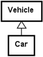

# Kapitel 12 – Nedarvning

## 1. Introduktion

Session 12 introducerer nedarvning.

Nedarvning gør det muligt for klasser at dele fælles responsibility (ansvar) og behavior (adfærd).

Målet er at modellere:

> "is-a"-relationer

Nedarvning understøtter:

- genbrug af kode
- undgåelse af duplikeret kode
- specialisering
- enklere vedligeholdelse
- et tydeligere objektorienteret design

Nedarvning er en af de centrale mekanismer i objektorienteret programmering.

---

## 2. "Is-a"-relationen

Nedarvning modellerer:

> is-a

Eksempler:

```text
Car is a Vehicle
```

```text
Van is a Car
```

```text
SportsCar is a Car
```

```text
Bicycle is a Vehicle
```

En underklasse er en mere specialiseret udgave af en superklasse.

Eksempel:


---

## 3. Superklasse og underklasse

Nedarvning introducerer to begreber.

### Superklasse

Den generelle klasse.

Eksempel:

```text
Vehicle
```

Har responsibility for fælles egenskaber:

- owner
- price

---

### Underklasse

Mere specialiserede klasser.

Eksempel:

```text
Car
```

Yderligere responsibility:

- registration number

Eksempel:

```text
Van
```

Yderligere responsibility:

- max load

Superklassen håndterer den generelle responsibility.

Underklassen håndterer den specialiserede responsibility.

---

## 4. Undgå duplikeret kode

Uden nedarvning:

```text
Car
- owner
- price
- regNo

Van
- owner
- price
- regNo
- maxLoad

SportsCar
- owner
- price
- regNo
- maxVelocity
```

Bemærk de gentagne oplysninger:

- owner
- price

Nedarvning fjerner denne duplikering.

Bedre design:

```text
Vehicle
- owner
- price

Car extends Vehicle
- regNo

Van extends Car
- maxLoad

SportsCar extends Car
- maxVelocity
```

---

## 5. Udvidelse af en klasse

Eksempel:

```java
public class Car extends Vehicle
{
}
```

Nøgleordet:

```java
extends
```

betyder:

> Car is a Vehicle

Underklassen arver automatisk superklassens behavior.

---

## 6. Konstruktørers responsibility

Superklassen etablerer superklassens state.

Eksempel:

```java
public class Vehicle
{
  private String owner;
  private double price;

  public Vehicle(String owner,
                 double price)
  {
    this.owner = owner;
    this.price = price;
  }
}
```

Underklassen etablerer underklassens state.

Eksempel:

```java
public class Car
  extends Vehicle
{
  private String regNo;

  public Car(String owner,
             double price,
             String regNo)
  {
    super(owner, price);

    this.regNo = regNo;
  }
}
```

---

## 7. Nøgleordet super

`super(...)` kalder superklassens konstruktør.

Eksempel:

```java
super(owner, price);
```

Det betyder:

> Lad `Vehicle` etablere sin egen state.

Derefter:

```java
this.regNo = regNo;
```

etablerer `Car` sin egen state.

Responsibility er fortsat adskilt.

---

## 8. Princippet om responsibility i konstruktører

Superklassens konstruktør:

```text
Etablerer superklassens state
```

Underklassens konstruktør:

```text
Etablerer underklassens state
```

Eksempel:

`Vehicle` etablerer:

- owner
- price

`Car` etablerer:

- regNo

Et godt design af responsibility er fortsat vigtigt.

---

## 9. Metodeopslag

Objekter kan kalde nedarvede metoder.

Eksempel:

```java
Vehicle v =
    new Car("Bob",
            125000,
            "BZ41377");
```

Kald:

```java
v.toString()
```

Java søger efter metoden i følgende rækkefølge:

1. `Car`
2. `Vehicle`
3. `Object`

Den nærmeste implementering anvendes.

---

## 10. Overskrivning af metoder

Underklasser kan levere specialiseret behavior.

Eksempel:

Superklasse:

```java
public String toString()
{
  return "Owner=" + owner;
}
```

Underklasse:

```java
public String toString()
{
  return super.toString()
       + ", regNo=" + regNo;
}
```

Underklassen udvider superklassens behavior.

---

## 11. Kald af superklassens metoder

Eksempel:

```java
super.toString()
```

Det betyder:

> Brug først superklassens implementering.

Tilføj derefter den specialiserede information.

Eksempel på output:

```text
Owner=Bob,
price=125000,
regNo=BZ41377
```

Dette reducerer duplikeret kode.

---

## 12. equals() og nedarvning

Superklassens lighed:

```java
public boolean equals(
    Object obj)
{
  // sammenlign superklassens felter
}
```

Underklassens lighed:

```java
return super.equals(obj)
    && regNo.equals(
           other.regNo);
```

Superklassen sammenligner:

- owner
- price

Underklassen sammenligner:

- regNo

Responsibility er fortsat opdelt i lag.

---

## 13. Referencer og polymorfi

Eksempel:

```java
Vehicle v =
    new Car(
        "Bob",
        125000,
        "BZ41377");
```

Referencetypen er:

```text
Vehicle
```

Det faktiske objekt er:

```text
Car
```

En superklassereference kan referere til objekter af underklasser.

Dette bliver endnu vigtigere senere i kurset.

---

## 14. Klassen Object

Alle Java-klasser nedarver fra:

```text
Object
```

Selv:

```java
public class Vehicle
```

betyder implicit:

```java
public class Vehicle
    extends Object
```

Alle klasser er direkte eller indirekte underklasser af `Object`.

---

## 15. Abstrakte klasser

Nogle gange er en klasse for generel.

Eksempel:

```text
Vehicle
```

Spørgsmålet er:

Giver det mening at oprette:

```java
new Vehicle("Bob", 200)
```

Nogle gange er svaret:

> Nej

---

## 16. En abstrakt klasse

Eksempel:

```java
public abstract class
TwoDimensionalShape
{
}
```

Nøgleordet:

```java
abstract
```

betyder:

> Klassen er ufuldstændig eller for generel.

Abstrakte klasser kan ikke instantieres.

Ugyldigt:

```java
TwoDimensionalShape s =
    new TwoDimensionalShape();
```

Dette giver en compilerfejl.

---

## 17. Abstrakte metoder

Eksempel:

```java
public abstract double
getArea();
```

Abstrakte metoder:

- har ingen implementering
- tvinger underklasser til at implementere behavior

Eksempel:


Hver underklasse implementerer:

```java
getArea()
```

på sin egen måde.

---

## 18. Implementering af abstrakte metoder

Eksempel:

```java
public double getArea()
{
  return radius
       * radius
       * Math.PI;
}
```

Underklassen færdiggør superklassens kontrakt.

---

## 19. Private kontra protected

Eksempel:

```java
private String owner;
```

Private felter:

- beskytter objektets state
- forbedrer encapsulation

Alternativ:

```java
protected String owner;
```

`protected` giver underklasser direkte adgang.

Kursets anbefaling:

Foretræk:

```java
private
```

Brug offentlige metoder til adgang.

Eksempel:

```java
getOwner()
```

Encapsulation er fortsat vigtig.

---

## 20. Responsibility og nedarvning

Superklasse:

```text
Generel responsibility
```

Underklasse:

```text
Specialiseret responsibility
```

Nedarvning bør modellere meningsfuld specialisering.

God løsning:



Dårlig løsning:


Dette er ikke nedarvning.

Det er en:

```text
has-a
```

-relation.

---

## 21. Typiske begynderfejl

Almindelige fejl:

1. At bruge nedarvning til `has-a`-relationer.
2. At duplikere superklassens felter.
3. At glemme `super(...)`.
4. At overskrive metoder unødvendigt.
5. At gøre alting abstrakt.
6. At bruge nedarvning, hvor komposition er et bedre valg.
7. At bryde grænserne for responsibility.
8. At forveksle superklassereferencer med objekter.

---

## 22. Refleksionsspørgsmål

- Hvad er en "is-a"-relation?
- Hvornår bør nedarvning bruges?
- Hvorfor kaldes `super(...)`?
- Hvad er superklassens responsibility?
- Hvad er underklassens responsibility?
- Hvorfor findes abstrakte klasser?
- Hvorfor foretrækkes private felter?

---

## Opsummering

Session 12 introducerer nedarvning.

Vigtige idéer omfatter:

- nedarvning modellerer "is-a"-relationer
- superklassen har den generelle responsibility
- underklassen har den specialiserede responsibility
- `extends` opretter en nedarvningsrelation
- `super(...)` etablerer superklassens state
- underklasser kan overskrive metoder
- abstrakte klasser modellerer ufuldstændige eller generelle begreber
- nedarvning reducerer duplikeret kode
- encapsulation er fortsat vigtig

Nedarvning gør det muligt at specialisere objekter, samtidig med at responsibility forbliver velorganiseret.
