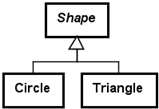
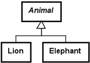

# Kapitel 13 – Design af nedarvning

## 1. Introduktion

Session 13 bygger videre på nedarvning.

Session 12 introducerede mekanismerne bag nedarvning.

Session 13 fokuserer på at designe nedarvning korrekt.

Fokus er på:

- design af nedarvning
- undgåelse af duplikeret kode
- konstruktørers responsibility (ansvar)
- overskrivning af metoder
- `super`
- `equals`
- `toString`
- abstrakte klasser
- encapsulation i forbindelse med nedarvning

Målet er ikke blot at anvende nedarvning.

Målet er:

> At bruge nedarvning, når det forbedrer det objektorienterede design.

---

## 2. Nedarvning modellerer "is-a"

Nedarvning repræsenterer:

> is-a

Eksempler:

```text
Car is a Vehicle
```

```text
Van is a Car
```

```text
SportsCar is a Car
```

```text
Circle is a Shape
```

God nedarvning:


Dårlig nedarvning:


En motor er ikke en bil.

Det er en:

```text
has-a
```

-relation og ikke en:

```text
is-a
```

-relation.

Nedarvning bør kun bruges til at modellere specialisering.

---

## 3. Responsibility i nedarvning

Superklasse:

```text
Generel responsibility
```

Underklasse:

```text
Specialiseret responsibility
```

Eksempel:

`Vehicle` har responsibility for:

- owner
- price

`Car` har responsibility for:

- registration number

`Van` har responsibility for:

- max load

`SportsCar` har responsibility for:

- max speed

Den generelle responsibility hører hjemme højt i hierarkiet.

Den specialiserede responsibility hører hjemme længere nede.

---

## 4. Undgå duplikeret kode

Uden nedarvning:

```text
Car
- owner
- price
- regNo

Van
- owner
- price
- regNo
- maxLoad
```

Bemærk den duplikerede information:

- owner
- price

Bedre design:

```text
Vehicle
- owner
- price

Car
- regNo

Van
- maxLoad
```

Nedarvning reducerer duplikeret kode.

Fordele:

- enklere vedligeholdelse
- mindre gentaget kode
- tydeligere design

Nedarvning bør gøre systemet enklere.

---

## 5. Konstruktørers responsibility

Superklassen etablerer superklassens state.

Eksempel:

```java
public class Vehicle
{
  private String owner;

  public Vehicle(String owner)
  {
    this.owner = owner;
  }
}
```

Underklassen etablerer underklassens state.

Eksempel:

```java
public class Car extends Vehicle
{
  private String regNo;

  public Car(String owner,
             String regNo)
  {
    super(owner);

    this.regNo = regNo;
  }
}
```

`Vehicle` etablerer:

- owner

`Car` etablerer:

- regNo

Responsibility er fortsat klart adskilt.

---

## 6. Kald af superklassens konstruktør

Eksempel:

```java
super(owner);
```

Det betyder:

> Lad superklassen etablere sin egen state.

Underklassen bør ikke duplikere superklassens felter.

Forkert:

```java
public class Car extends Vehicle
{
  private String owner;
}
```

`owner` findes allerede i `Vehicle`.

Duplikering af superklassens data giver et dårligt design.

---

## 7. Overskrivning af metoder

Underklasser kan udvide nedarvet behavior.

Eksempel:

`Vehicle`:

```java
public String toString()
{
  return "Owner=" + owner;
}
```

`Car`:

```java
public String toString()
{
  return super.toString()
       + ", regNo=" + regNo;
}
```

Underklassen bygger videre på superklassens behavior.

Det undgår duplikeret kode.

---

## 8. Kald af superklassens metoder

Eksempel:

```java
super.toString()
```

Det betyder:

> Brug først superklassens implementering.

Tilføj derefter information fra underklassen.

Eksempel:

`Vehicle`:

```text
Owner=Bob
```

`Car`:

```text
Owner=Bob,
regNo=BZ41377
```

Superklassens behavior bør ofte genbruges.

---

## 9. Design af equals()

Superklassens lighed:

```java
public boolean equals(
    Object obj)
{
  if (obj == null)
  {
    return false;
  }

  Vehicle other =
      (Vehicle)obj;

  return owner.equals(
             other.owner);
}
```

Underklassens lighed:

```java
public boolean equals(
    Object obj)
{
  Car other =
      (Car)obj;

  return super.equals(obj)
      && regNo.equals(
             other.regNo);
}
```

Superklassen sammenligner:

- superklassens state

Underklassen sammenligner:

- underklassens state

Lighed er fortsat opbygget lagvist.

---

## 10. Abstrakt eller ej?

Nogle klasser er for generelle.

Spørgsmålet er:

Bør dette være muligt?

```java
new Vehicle("Bob")
```

Nogle gange er svaret:

> Nej

Eksempler på klasser, der kan være abstrakte:

```text
Vehicle
Shape
Animal
```

Eksempler:





Abstrakte klasser modellerer begreber, der er ufuldstændige eller for generelle.

---

## 11. Hvorfor bruge abstrakte klasser?

To almindelige grunde:

### Ufuldstændig klasse

Eksempel:

```java
public abstract double
getArea();
```

Der findes ingen implementering.

Underklasserne skal levere den.

---

### For generel

Eksempel:

```text
Vehicle
```

Et generelt begreb bør nogle gange forhindre oprettelse af objekter.

`abstract` forhindrer, at:

```java
new Vehicle(...)
```

kan kompileres.

---

## 12. Encapsulation og nedarvning

Eksempel:

```java
private String owner;
```

Private felter:

- beskytter objektets state
- bevarer invarianter

Alternativ:

```java
protected String owner;
```

`protected` giver underklasser direkte adgang.

Kursets anbefaling:

Foretræk:

```java
private
```

Brug metoder:

```java
getOwner()
```

Encapsulation er fortsat vigtig – også ved nedarvning.

---

## 13. Foretræk encapsulation

God løsning:

```java
super.toString()
```

God løsning:

```java
getOwner()
```

Mindre god løsning:

```java
protected owner
```

Direkte adgang til felter øger coupling (kobling).

Encapsulation beskytter objektets gyldige state.

Et godt design er fortsat vigtigt.

---

## 14. Test af nedarvning

Behavior i forbindelse med nedarvning bør testes.

Eksempel:

```java
@Test void testToString()
{
  Vehicle car =
      new Car(
          "Bob",
          125000,
          "BZ41377");

  assertEquals(
      "Owner=Bob, "
    + "price=125000.0, "
    + "regNo=BZ41377",
      car.toString());
}
```

Tests bør kontrollere:

- konstruktørers behavior
- nedarvet behavior
- overskrevne metoder
- konkrete underklasser af abstrakte klasser

Test er fortsat en vigtig del af udviklingen.

---

## 15. Typiske begynderfejl

Almindelige fejl:

1. At bruge nedarvning til `has-a`-relationer.
2. At duplikere superklassens felter.
3. At glemme `super(...)`.
4. At undlade at genbruge superklassens metoder.
5. At gøre alting abstrakt.
6. At bruge `protected` unødvendigt.
7. At bryde encapsulation.
8. At overskrive metoder uden et klart formål.

---

## 16. Refleksionsspørgsmål

- Hvad er en "is-a"-relation?
- Hvorfor bruges nedarvning?
- Hvorfor kaldes `super(...)`?
- Hvorfor bør superklassens felter ikke duplikeres?
- Hvornår bør en klasse være abstrakt?
- Hvorfor foretrækkes private felter?
- Hvorfor bruges `super.toString()`?

---

## Opsummering

Session 13 fokuserer på design af nedarvning.

Vigtige idéer omfatter:

- nedarvning modellerer "is-a"-relationer
- nedarvning reducerer duplikeret kode
- superklassens responsibility er generel
- underklassens responsibility er specialiseret
- konstruktører etablerer deres egen state
- `super(...)` initialiserer superklassens state
- overskrivning udvider behavior
- abstrakte klasser modellerer ufuldstændige begreber
- encapsulation er fortsat vigtig

Et godt design af nedarvning forbedrer læsbarheden, vedligeholdelsen og den objektorienterede struktur.
