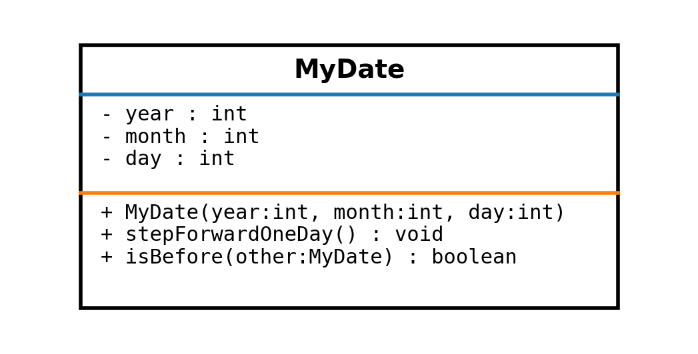
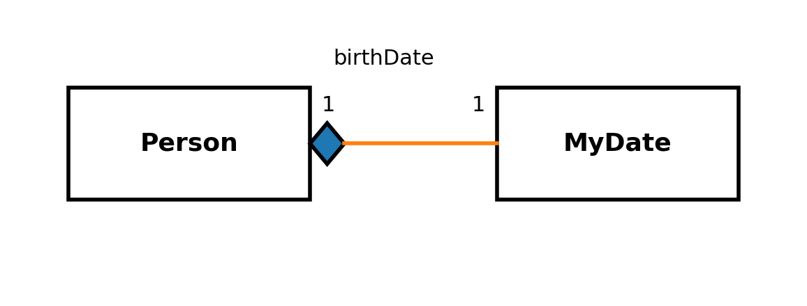
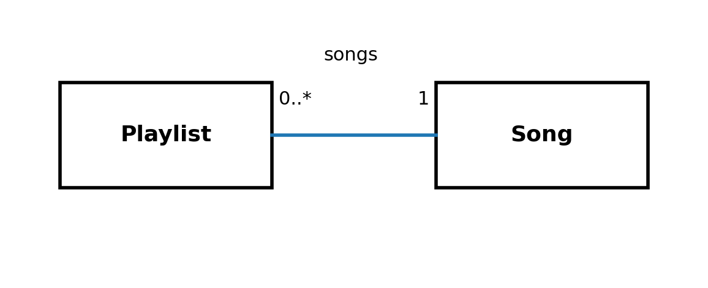

# Kapitel 16 – Klassediagrammer

## 1. Introduktion

Klassediagrammer bruges til at beskrive strukturen i en domænemodel: hvilke klasser der findes, hvilke data de rummer, hvilke metoder de tilbyder, og hvordan de hænger sammen.

I PRO1 bruges UML som modelleringsværktøj. Diagrammet er ikke “Java på papir”, men en måde at diskutere ansvar, ejerskab og samarbejde, før der skrives kode.

## 2. Klasse

I et UML-klassediagram vises en klasse typisk som en boks med tre områder:
1) Klassenavn
2) Attributter (felter)
3) Operationer (metoder)

Synlighed angives ofte med symboler:
+ public
- private

Figur 16.1 – UML-klasseboks med navn, attributter og metoder

Bemærk at UML viser typer og signaturer, men ikke implementeringen. Når metoden stepForwardOneDay står i diagrammet, betyder det: ”objektet tilbyder denne adfærd”. Hvordan den implementeres, er et senere valg.

## 3. Metoder

En metode i UML angives med navn, parametre og returtype. Det gør det muligt at diskutere klassens ansvar:

- Hvilke handlinger skal objektet tilbyde?
- Hvilke oplysninger skal objektet skjule?
- Hvilke operationer er centrale i domænet?

Hvis MyDate har metoden isBefore, er det et signal om, at sammenligning af datoer er en del af klassens ansvar.

## 4. Relationer

Relationer viser, at objekter kan referere til hinanden og samarbejde.

UML skelner bl.a. mellem:
- Association (generel relation)
- Aggregation (svagt ejerskab, hul diamant)
- Composition (stærkt ejerskab, sort diamant)

Figur 16.2 – Composition mellem Person og MyDate

I figuren betyder composition, at Person i modellen ejer sin MyDate (fx fødselsdato) som en del af sin interne tilstand. Det er et designvalg, som hænger sammen med indkapsling og representation exposure.

## 5. Multipliciteter

Multipliciteter angiver, hvor mange objekter der kan være i relationen på hver side.

Typiske multipliciteter:
- 1 (præcis én)
- 0..1 (nul eller én)
- 0..* (nul eller mange)
- 1..* (mindst én)
- Et konkret tal (fx 4)

Figur 16.3 – Multiplicitet: Playlist har 0..* Song

Multiplicitet er ikke en syntaksregel, men en del af domæneforståelsen. Hvis en Playlist kan være tom, giver 0..* mening. Hvis domænet kræver mindst én sang, ville 1..* være mere præcist.

## 6. Designovervejelser

Et klassediagram er nyttigt, når det bruges til at diskutere ansvar og grænser.

Fordele:
- Giver fælles sprog i gruppen
- Synliggør ejerskab og koblinger
- Hjælper med at opdage uklare ansvar tidligt

Ulemper:
- Kan blive for detaljeret, hvis man prøver at ”tegne al kode”
- Kan give falsk tryghed, hvis man ikke tester antagelserne i implementeringen

## 7. Typiske fejl og misforståelser

1) At tegne implementering i stedet for model (fx loops og if/else i UML).
2) At ignorere ejerskab og kun tegne linjer mellem klasser.
3) At vælge multipliciteter uden at begrunde dem i domænet.
4) At gøre alle relationer til composition, fordi det ser ”stramt” ud.

## 8. Refleksionsspørgsmål

1) Hvilken information giver et klassediagram, som kildekode ikke giver lige så hurtigt?
2) Hvordan kan multipliciteter afsløre manglende krav i en kravtekst?
3) Hvornår bliver et klassediagram for detaljeret til at være nyttigt?

## 9. Små øvelser

Øvelse 1: Læs en kort kravtekst (fx ”et bibliotekssystem”) og lav et første udkast til et klassediagram. Markér hvilke relationer der er association, aggregation eller composition.

Øvelse 2: Vælg én relation i dit diagram og begrund multipliciteten med konkrete scenarier (fx ”kan en låner have nul bøger?”).
