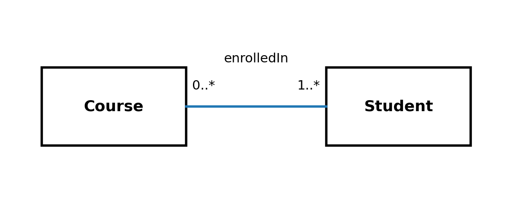

# Kapitel 17 – Fra tekst til model

## 1. Introduktion

I dette kapitel arbejder vi systematisk med overgangen fra kravtekst til model. Målet er at kunne læse en tekst og omsætte den til et UML-klassediagram med klare ansvar og invariants.

Domænemodellering starter i sproget – ikke i Java.

## 2. Eksempelcase

Eksempel:

“Et kursussystem håndterer kurser og studerende. Et kursus har et navn og et antal ECTS-point. En studerende kan være tilmeldt flere kurser. Et kursus skal have mindst én studerende for at blive oprettet.”

Opgaven er nu at identificere begreber, relationer og regler.

## 3. Identifikation af klasser

Typiske substantiver i teksten er kandidater til klasser:
- Course
- Student

ECTS-point og navn er egenskaber – ikke selvstændige klasser i denne model.

Spørg altid: Har begrebet selvstændig identitet og ansvar? Hvis ja, bør det sandsynligvis være en klasse.



Figur 17.1 – UML-model for Course og Student

I figuren ses en association mellem Course og Student med multipliciteter.

## 4. Invariants i UML

Invariants er regler, der altid skal være sande.

I eksempelcasen kan vi formulere:
- ECTS > 0
- Course har mindst én Student (1..*)

Multipliciteten 1..* udtrykker en invariant i modellen: Et kursus uden studerende er ikke gyldigt i dette domæne.

Invariants kan også noteres som tekst i UML (fx i en note), men vigtigst er, at de diskuteres eksplicit.

```
public class Course {

    private String name;
    private int ects;

    public Course(String name, int ects) {
        if (ects <= 0) {
            throw new IllegalArgumentException("ECTS must be positive");
        }
        this.name = name;
        this.ects = ects;
    }
}
```
Her implementeres en invariant fra modellen direkte i konstruktøren.

## 5. Designovervejelser

Overgangen fra tekst til model kræver fortolkning.

Forskellige modeller kan være valide – men de skal kunne begrundes.

Spørg:
- Hvilke begreber er centrale?
- Hvilke regler er ufravigelige?
- Hvem har ansvar for hvad?

## 6. Typiske fejl og misforståelser

1) At modellere alle substantiver som klasser.
2) At ignorere implicitte regler i teksten.
3) At vælge multipliciteter uden begrundelse.
4) At gå direkte til implementering uden model.

## 7. Refleksionsspørgsmål

1) Hvordan kan man systematisk udlede invariants fra en tekst?
2) Hvad sker der, hvis en implicit regel overses i modellen?
3) Kan to forskellige modeller begge være korrekte? Hvornår?

## 8. Små øvelser

Øvelse 1: Modellér et simpelt bookingsystem (Room og Booking). Identificér mindst én invariant.

Øvelse 2: Tag en kravtekst fra et tidligere projekt og identificér klasser, relationer og multipliciteter.
